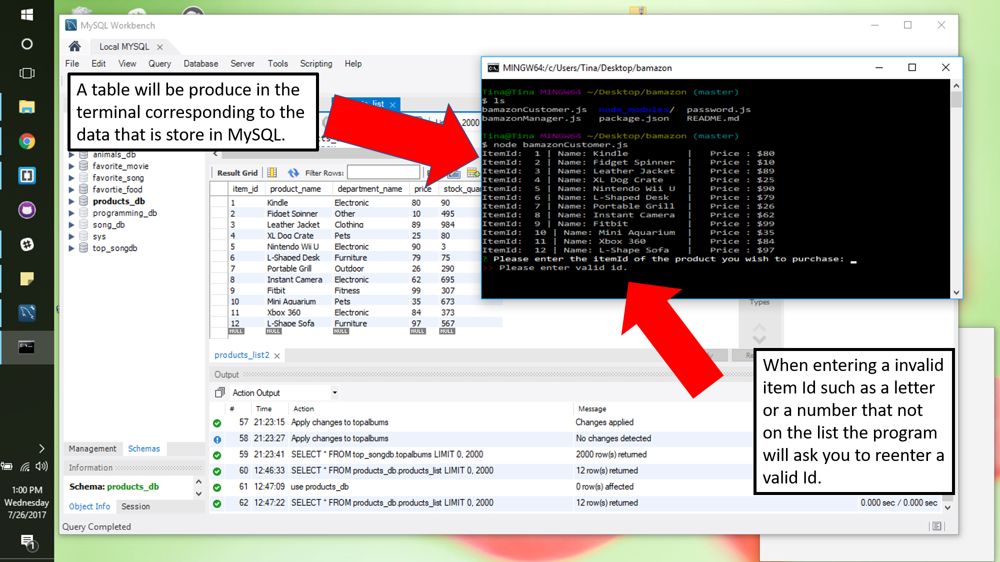
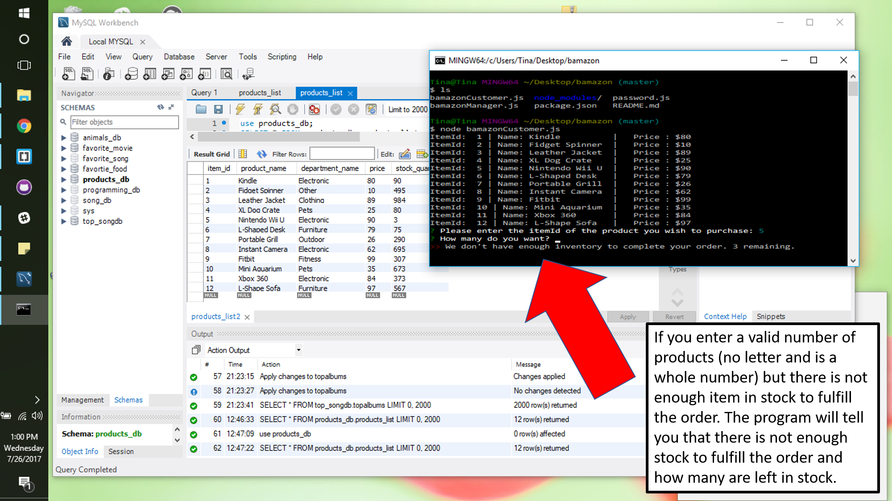
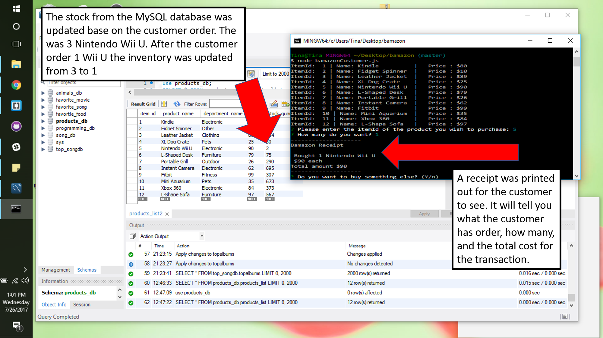

# bamazon
An inventory system of an online storefront with the MySQL. The app will take in orders from customers and deplete stock from the store's inventory. 

Here are some screenshots of how the bamazonCustomer code will work.

